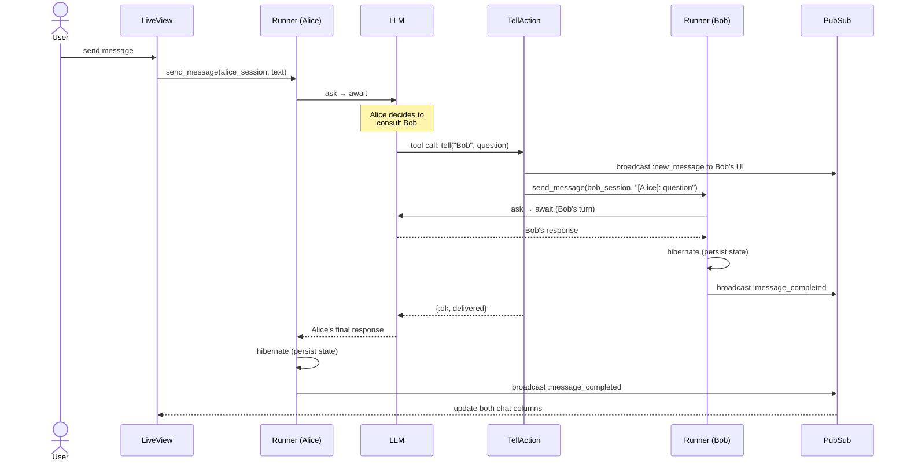

# Murmur

A real-time multi-agent chat interface built with Phoenix LiveView and the [Jido](https://github.com/agentjido/jido) agent framework. Create workspaces, add AI agents, and watch them collaborate — with persistent conversations and agent-to-agent communication.

## Features


- **Multi-agent workspaces** — Add multiple AI agents, each with independent chat history
- **Agent-to-agent messaging** — Agents communicate via the "tell" tool, with message queuing when busy
- **Real-time streaming** — Token-by-token responses over WebSocket
- **Persistent conversations** — History survives server restarts via hibernate/thaw
- **Autonomous execution** — Agents continue processing server-side during disconnects
- **Agents produce artifacts** - Agents can produce artifacts that affect the UI, e.g. the Arxiv agent can display papers.
- **Tasks** - Agents manage a task board to track their work, allowing long-running agents to converge on complex goals over multiple interactions.

## Getting Started

**Prerequisites:** Elixir, Erlang/OTP, PostgreSQL (or Docker), and an `OPENAI_API_KEY`.

```bash
# Start PostgreSQL via Docker
docker compose up -d

# Install deps, create DB, run migrations
mix setup

# Start the server
mix phx.server
```

Visit [localhost:4000](http://localhost:4000), create a workspace, add agents, and start chatting.

## How It Works

When a user sends a message, the Runner queues it and calls the LLM. If the agent decides to collaborate, it invokes the **tell** tool — which queues a message on the target agent's Runner, kicking off a parallel conversation. Both responses stream back to the UI via PubSub.



## Development

```bash
mix test            # Run tests
mix precommit       # Format + compile + lint + dialyzer + test
```
