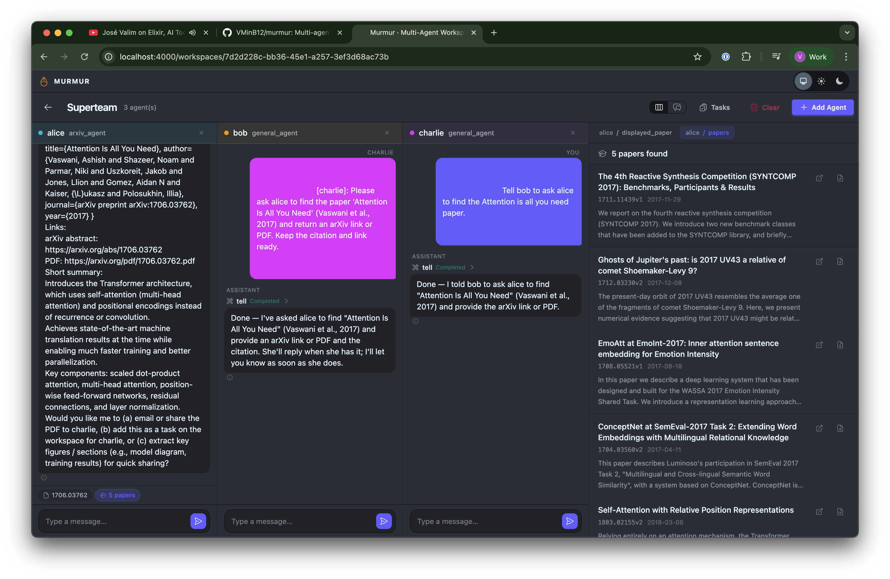
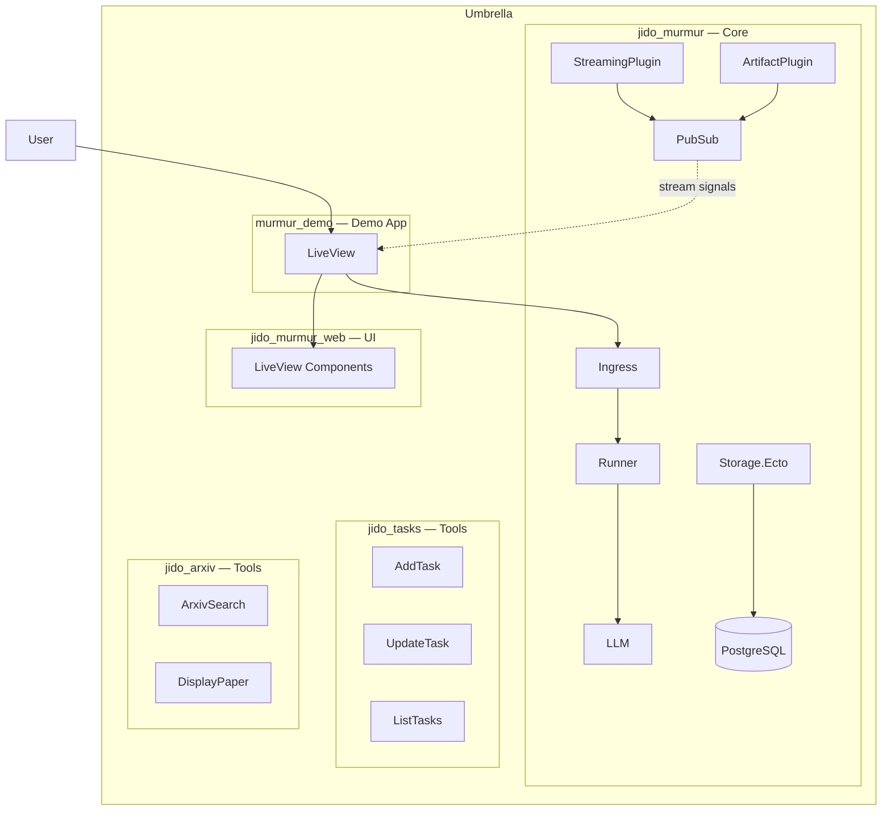
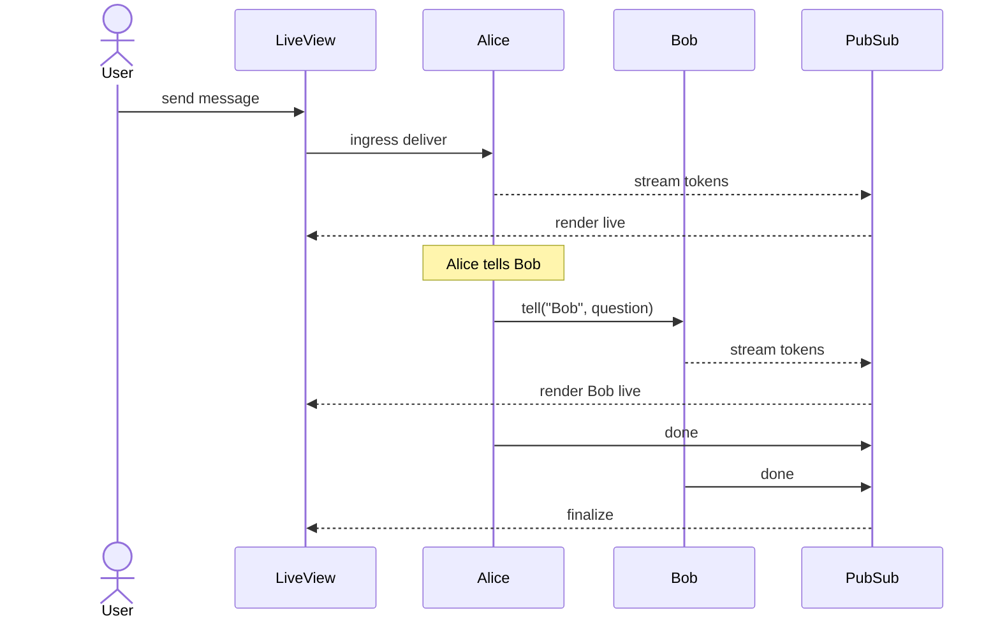

# Murmur

A real-time multi-agent chat interface built with Phoenix LiveView and the [Jido](https://github.com/agentjido/jido) agent framework. Create workspaces, add AI agents, and watch them collaborate — with persistent conversations and agent-to-agent communication.

## Project Structure

This is a Mix umbrella project containing independently publishable Hex packages and a demo application:

```
murmur/
├── apps/
│   ├── jido_murmur/         # Core backend — Ingress, Runner, Plugins, Storage, Schemas
│   ├── jido_murmur_web/     # Optional LiveView chat components
│   ├── jido_tasks/          # Task management tools for agents
│   ├── jido_arxiv/          # arXiv academic research tools
│   └── murmur_demo/         # Reference Phoenix app using all packages
├── config/                  # Shared umbrella configuration
└── mix.exs                  # Umbrella root
```

| Package | Description | Hex |
|---------|-------------|-----|
| [`jido_murmur`](apps/jido_murmur/) | Multi-agent orchestration — Ingress, Runner, Plugins, Storage, Schemas | [](https://hex.pm/packages/jido_murmur) |
| [`jido_murmur_web`](apps/jido_murmur_web/) | Pre-built LiveView components for chat UI | [](https://hex.pm/packages/jido_murmur_web) |
| [`jido_tasks`](apps/jido_tasks/) | Task management Jido.Action tools | [](https://hex.pm/packages/jido_tasks) |
| [`jido_arxiv`](apps/jido_arxiv/) | arXiv search and paper display tools | [](https://hex.pm/packages/jido_arxiv) |

## Features



- **Multi-agent workspaces** — Add multiple AI agents, each with independent chat history
- **Agent-to-agent messaging** — Agents communicate via the "tell" tool, with ingress-coordinated busy-run delivery
- **Real-time streaming** — Token-by-token responses over WebSocket
- **Persistent conversations** — History survives server restarts via hibernate/thaw
- **Autonomous execution** — Agents continue processing server-side during disconnects
- **Artifacts** — Agents produce rich artifacts that affect the UI (e.g. the arXiv agent can display papers)
- **Shared task board** — Agents manage tasks collaboratively, allowing long-running convergence on complex goals
- **Split & unified views** — Side-by-side agent columns, or a merged timeline with `@mention` routing

## Getting Started

**Prerequisites:** Elixir, Erlang/OTP, PostgreSQL (or Docker), and an `OPENAI_API_KEY`.

```bash
# Start PostgreSQL via Docker
docker compose up -d

# Install deps, create DB, run migrations
mix setup

# Start the server
mix phx.server
```

Visit [localhost:4000](http://localhost:4000), create a workspace, add agents, and start chatting.

## Architecture



## How It Works

When a user sends a message, `JidoMurmur.Ingress` decides whether to start a fresh run or steer an active one. Tokens stream back in real-time via PubSub. If the agent decides to collaborate, it uses the **tell** tool to deliver follow-up input through the target agent's ingress coordinator — kicking off a parallel conversation without a Murmur-owned semantic queue.



## Using as a Library

To use jido_murmur in your own Phoenix application, see the [jido_murmur README](apps/jido_murmur/README.md) for installation and configuration instructions.

## Development

```bash
mix test            # Run all tests across the umbrella
mix test --app jido_murmur  # Run tests for a specific package
mix precommit       # Format + compile + lint + credo + sobelow + test
```
